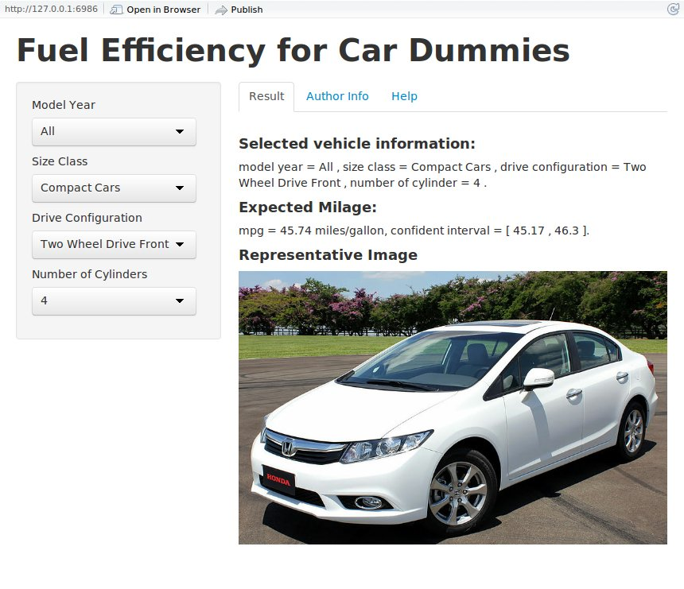

Fuel Efficiency for Car Dummies
========================================================
author: Vinh N. Pham
date: Tue Oct 21 20:02:52 2014
transition: zoom
Overview
========================================================

- Exploring fuel efficiency of various vehicle models from the years 2010 to 2012
- Intuitve options geared toward beginning consumers (like myself)
    + Model Year
    + Size Class: Compact Cars, Large Cars, Cargo Type Vans, ...
    + Drive Configuration: Two Wheel Drive, Four Wheel Drive ...
    + Number of Cylinder: Number of cylinder in vehicle engine.  2, 4, 8, ...  The default is 4
- Web interface: easier setup, larger user bases.

Screenshot
========================================================



Model
========================================================

- Fuel efficiency models use linear regression

```r
lmModel[["All"]]  <<- lm(formula = FE ~ NumCyl + DriveDesc + CarlineClassDesc, data = carsDB[["All"]])
```

- example of the core part of prediction


```r
(prediction("2010", "Compact Cars", "Two Wheel Drive Front", "4"))
```

```
[1] "mpg = 44.8 miles/gallon, confident interval = [ 44.16 , 45.43 ]."
```

Notes
=======================================================
- The represented image correspond to only the Size Class option
    + Blank image if the "Other" choice is selected.
- Notify user if there is no vehicle in the database with the same Size Class and Drive Configuration.
    + Linear models only provide prediction for existing configuration of categorical variables.
    + This is not the case for numerical variables.
